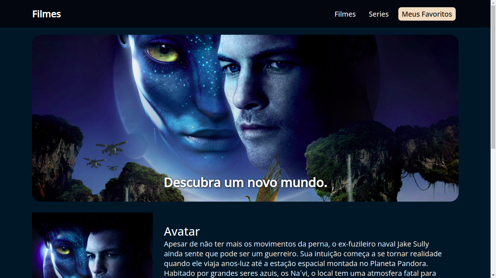
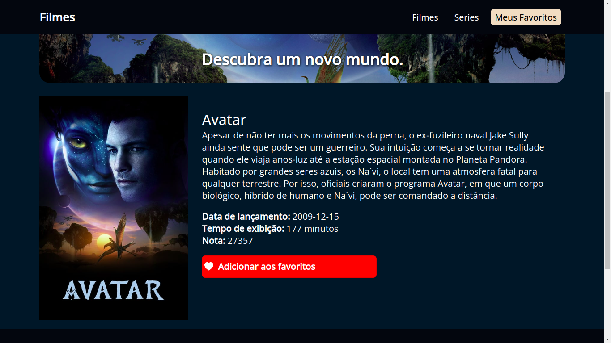
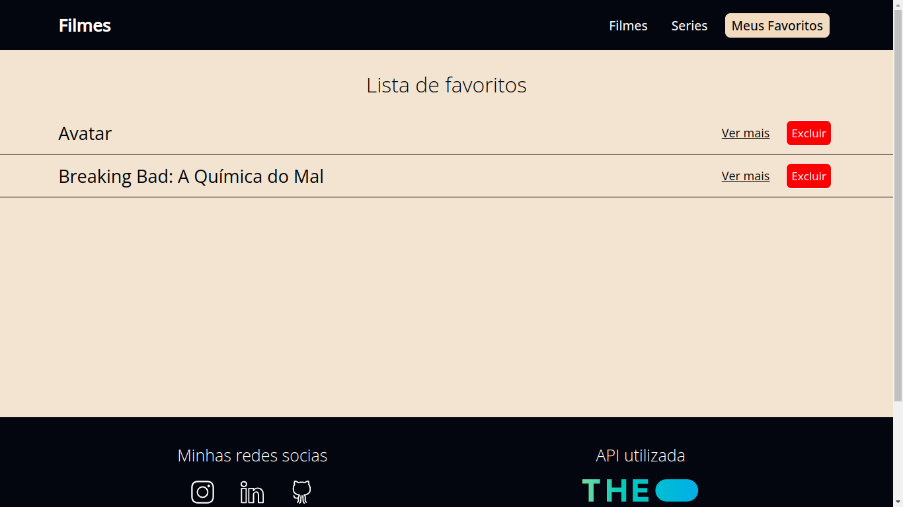

# Filmes em cartaz com api 📚

## Informações ℹ️

<ul>
    <li>O projeto foi feito com a api do <a href="https://www.themoviedb.org/documentation/api" target="_blank">The Movie DB</a> listando os filmes e séries em cartaz, populares e melhores avaliados</li>
    <li>O projeto tem um sistema de rotas utilizando o <b>react-router-dom</b> tendo duas apenas duas rotas</li>
</ul>

## Tecnologias usadas 🖥️

<ul>
    <li>HTML 5</li>
    <li>CSS 3</li>
    <li>JAVASCRIPT</li>
    <li>REACT</li>
</ul>

## Capturas de tela 📸

## Executar projeto 🤓

<ul>
    <li>Instalar node em sua máquina</li>
    <li>Abrir projeto e dar npm start</li>
    <li>Ou vocẽ pode abrir o projeto na web <a href="https://filmesapidb.netlify.app/" target="_blank">Clicando aqui!</a></li>

</ul>

## Funcionalidades

<ul>
    <li>A funcionalidade de adicionar aos favoritos e salvar na local storage</li>
    <li>Existe um sistema de scroll movie indo em direção aos filmes e paras as series</li>
    <li>O site é totalmente responsivel</li>
</ul>

## Status do Projeto 📃

🚀 Concluído

## Contato 📞

<ul>
    <li><a href="https://github.com/fabriluan" target="_blank">Github</a></li>
    <li><a href="https://www.linkedin.com/in/fabricio-cipriano-a72672248/" target="_blank">Linkedin</a></li>
</ul>
